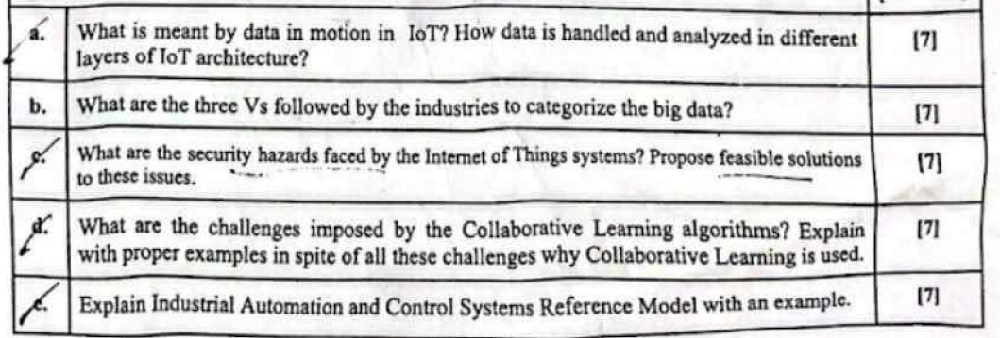

# Internet of Things (IoT) Study Guide

## Section 1

### a. Impact of IoT

- Unprecedented connectivity of "things" (sensors, actuators, appliances) transforms industries—manufacturing, healthcare, transport—by enabling real-time monitoring, predictive maintenance and automation
- Generates massive data that drives new services (e-health alerts, smart grids, precision agriculture), improves resource utilization and creates business-model innovation

### b. oneM2M IoT Architecture

- **Application Entities (AEs)**: host end-user applications on devices, gateways or servers
- **Common Services Entities (CSEs)**: provide middleware functions (data management, security, discovery, interworking)
- **Network Services Entities (NSEs)**: interface CSEs with underlying network technologies (cellular, Ethernet, LoRaWAN)

### c. Federated Learning (FL)

- Collaborative ML paradigm where clients (devices or edge servers) train a shared global model locally on private data
- Only model updates (gradients/weights) are sent to a central server for aggregation (e.g. Federated Averaging), preserving data privacy
- Handles Non-IID data and limited compute/communication resources; key for IoT/edge scenarios

### d. Fog Computing

- Layer of decentralized compute/storage nodes (gateways, routers, edge servers) between IoT devices and cloud
- Performs local preprocessing, filtering, analytics to reduce latency and bandwidth before forwarding to central cloud
- Offers contextual awareness, geographic distribution and supports real-time/intermittent connectivity use cases

### e. Smart Object & Characteristics

- A Smart Object embeds sensors/actuators, microcontroller, network interface and unique ID to sense, process and communicate data
- Key traits:

  - Autonomous data capture
  - Unique addressing
  - Low power operation
  - Programmable behavior
  - Interoperability across protocols
  - Secure, fail-safe and context-aware
  - Service-oriented and collaborative

### f. Wireless-Based Solution: Advantages & Disadvantages

#### Advantages

- Flexible deployment
- Device mobility
- Rapid scaling
- Lower wiring cost
- Good reach (sub-GHz LPWA, cellular)

#### Disadvantages

- Limited spectrum (interference, regulation)
- Variable latency/reliability
- Higher power draw for radio
- Security/vulnerability concerns
- Range vs. throughput trade-offs

### g. IoT Data Analytics Challenges

- Volume, velocity and variety ("3Vs") of sensor data overwhelm traditional databases—requires scalable storage, real-time stream processing and edge/cloud analytics
- Unreliable, noisy or missing data from heterogeneous IoT sources complicates cleaning, fusion and inference
- Privacy, security and interoperability constraints limit data sharing and consistent analytics across domains

## Section 2

### a. Data in Motion in IoT

"Data in motion" refers to the continuous streams of sensor- and event-generated data as it travels through an IoT system:

#### Device layer

- Raw sensor readings (e.g. temperature, vibration) are captured and forwarded via lightweight protocols (MQTT, CoAP)

#### Edge/Fog layer

- Streams are ingested into local brokers or stream processors for real-time filtering, aggregation and event detection

#### Cloud layer

- High-volume streams feed scalable platforms (Kafka, Spark Streaming) for complex analytics, dashboarding, long-term storage and batch processing

### b. The Three Vs of Big Data

Industries classify IoT‐generated big data by:

- **Volume**: massive scale of data (e.g. millions of devices producing GB/day)
- **Velocity**: high ingestion rates and real-time requirements (e.g. sub-second event streams)
- **Variety**: heterogeneous formats (structured, unstructured, time-series, multimedia)

### c. IoT Security Hazards & Solutions

#### Hazards

- Insecure legacy/OT protocols (Modbus, DNP3) with no authentication or encryption
- Device insecurity and poor patching on resource-constrained nodes
- Network segmentation erosion leading to undue lateral movement
- Data spoofing, replay and DoS on unreliable wireless links

#### Feasible solutions

- End-to-end encryption (TLS/DTLS) and mutual authentication on all links
- Secure boot/firmware integrity and regular OT patch-management processes
- Micro-segmentation using VLANs/VPNs and zero-trust gateways
- Runtime anomaly monitoring and periodic risk assessments (e.g. OCTAVE Allegro)

### d. Challenges & Rationale for Collaborative Learning

#### Challenges

- Statistical heterogeneity (non-IID data across clients)
- System heterogeneity (variable compute, connectivity, availability)
- Communication bottlenecks sending model updates or intermediate activations
- Straggler devices and synchronization overhead
- Potential privacy leakage via gradient or activation inversion attacks

#### Why still used

- Preserves data privacy by keeping raw data local (e.g. hospitals jointly training a diagnostic model without sharing patient records)
- Leverages distributed compute/edge resources to scale ML training
- Reduces cloud bandwidth by transmitting only model updates or split activations

### e. IACS Reference Model (e.g. CPWE)

The Industrial Automation & Control Systems (IACS) reference model layers an industrial plant into:

1. Field/Process level: sensors/actuators measuring physical processes
2. Basic Control level: PLCs/RTUs performing real-time control loops
3. Supervisory level: SCADA/HMI aggregating data for operators
4. Operations/Management: MES for production scheduling and KPI tracking
5. Enterprise level: ERP for corporate resource planning

**Example**: In a bottling plant, flow sensors (Level 0) feed a PLC that controls conveyor speed (Level 1); plant operators use an HMI (Level 2) to adjust settings; MES schedules batches (Level 3); ERP handles order fulfillment (Level 4).

## Section 3

### a. Real‐Time Location Systems (RTLS) in Manufacturing

- Uses tags (RFID/UWB/BLE) on tools, WIP, pallets and a grid of anchors to compute asset locations in real time
- Solves misplacement, manual inventory, bottlenecks and safety (collision warnings) by feeding location data to MES/SCADA
- Proposed system:
  - Tags on parts & forklifts; UWB anchors in workshop; edge gateways running fog nodes for local alerts (zone entry/exit, congestion)
  - Fog layer aggregates & filters position streams; cloud runs historical analytics (throughput, layout optimization)

### b. Holistic Industrial Security in Car Manufacturing

Layered defense per OT-IoT convergence (Book Ch 8 + OCTAVE):

1. Risk assessment via OCTAVE Allegro to prioritize assets (robots, PLCs, SCADA)
2. Device hardening: secure boot, signed FOTA, HSM-backed keys on controllers
3. Network micro-segmentation (VLANs, zero-trust gateways) isolating assembly line, QA, logistics
4. Encrypted MQTT/TLS for sensor telemetry; DTLS for wireless (LPWA/5G)
5. Edge IDS/IPS on fog gateways; continuous anomaly monitoring & SOC integration

### c. Smart Street‐Lighting Architecture

- **Field layer**: LED fixtures w/ ambient-light & motion sensors + local microcontroller
- **Edge/Fog layer**: Lamppost gateways running local control (adaptive dimming, fault detection)
- **Network**: 6LoWPAN/LoRaWAN mesh to neighborhood gateway → IP backhaul
- **Cloud**: Central management platform (Hadoop/Spark) for usage analytics, energy forecasts, batch firmware updates
- **Security**: DTLS-secured links, ACLs on gateways, PKI for node identity

### d. Smart-City Blueprint for Public Safety

- Multi-sensor fabric: CCTV, environmental (air, noise), RTLS for people/vehicles, emergency call points
- Converged Plantwide Ethernet (CPWE) backbone using resilient-Ethernet protocols for deterministic, redundant links
- Edge compute (fog) at precinct level for real-time incident detection (e.g. gunshot, crowd density) and local alerts
- Cloud analytics (Hadoop ecosystem) for long-term trend, predictive policing & resource planning
- Security & resilience by OCTAVE-driven risk management, encrypted comms, role-based access & micro-segmentation
