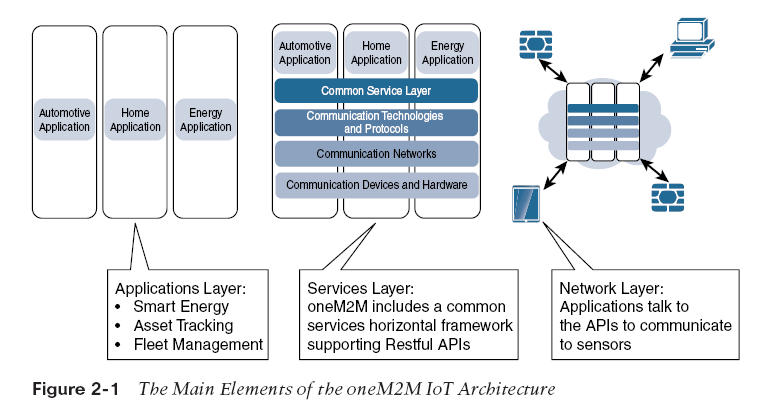
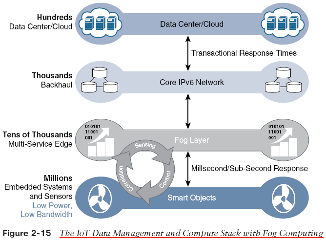

# IT vs. IoT Networks

The difference between IT and IoT networks is much like the contrast between residential and stadium architecture. The key difference is data.

## IoT Architectural Drivers

### Scale

- **Issue**: IoT endpoints (sensors) far exceed the scale of typical IT networks.
- **Challenge**: IPv4 address exhaustion prevents scalability.
- **Solution**: Use IPv6 for IoT; IT networks often continue with IPv4 and NAT.

### Security

- **Issue**: IoT devices, especially in wireless sensor networks (WSNs), are physically exposed.
- **Challenge**: Secure every IoT endpoint with device-level authentication and encryption.
- **Requirement**: Support zero-touch deployment models.

### Constrained Devices & Networks

- **Characteristics**: Networks are constrained, lossy, and support only low data rates (tens of bps to hundreds of Kbps) due to long distances and massive scale.
- **Need**: New last-mile wireless technologies and modifications to traditional network-layer transport.

### Massive Data Generation

- **Issue**: Sensors generate enormous amounts of data daily, causing network bottlenecks.
- **Solution**: Distribute data analytics from the edge to the cloud, unlike traditional IT where analytics runs only in the cloud.

### Legacy Device Support

- **Challenge**: IoT networks often mix modern IP endpoints with legacy non-IP devices.
- **Requirement**: Provide protocol translation or tunneling (e.g., to support Ethernet/IP).

### Real-Time Data Analysis

- **Contrast**: Traditional IT performs batch processing; IoT demands real-time analysis.
- **Solution**: Position analytics software nearer to the edge for streaming data processing.

## oneM2M and IoTWF Architectures

- **oneM2M**: Emphasizes IoT services, applications, and standardized northbound API definitions.
- **IoT World Forum (IoTWF)**: Provides a simplified view including edge computing, data storage, and access.

### oneM2M Architecture Domains

- **Applications Layer**: Focus on device connectivity and standardizing APIs for business intelligence.
- **Services Layer**: Horizontal framework covering network management, backhaul communications (e.g., cellular, MPLS, VPNs), and middleware.
- **Network Layer**: Handles communication between IoT devices; may use a Field Area Network (FAN) for specific applications.

## IoT Reference Model (IoTWF)

Data flows upward from the edge (sensors/devices) to the center (cloud/data center).

### Layer 1: Physical Devices and Controllers

- **Role**: Houses the “things” (sensors, endpoints) in IoT.

### Layer 2: Connectivity

- **Focus**: Reliability and timely transmission of data.
- **Functions**:
  - Communication among devices
  - Switching, routing & protocol translation
  - Network-level security

### Layer 3: Edge Computing (Fog)

- **Role**: Processes and filters data as close to the source as possible.
- **Functions**:
  - Evaluate, reformat, and aggregate data
  - Filter data to reduce traffic for higher-level processing

## Summary of Layers 4–7 (IoTWF Reference Model)

- **Layer 4: Data Accumulation**  
  Captures and stores data; converts event-based data for query-based processing.
- **Layer 5: Data Abstraction**  
  Reconciles diverse data formats into a consistent, unified view using virtualization.
- **Layer 6: Applications**  
  Interprets and acts on data through monitoring, control, and reporting.
- **Layer 7: Collaboration and Processes**  
  Shares information among systems; transforms business processes with IoT insights.

## IoT System Architecture Framework

Our framework consists of two parallel stacks:

- **IoT Data Management and Compute Stack**
- **Core IoT Functional Stack**

## Smart Objects Classification

Factors that influence smart object design:

- **Power Source**: Battery-powered vs. power-connected.
- **Mobility**: Mobile (changing locations) or static.
- **Reporting Frequency**: Low vs. high frequency, affecting energy consumption.
- **Data Richness**: Simple (small data packets) vs. rich data (detailed reports).
- **Report Range**: Distance to the gateway.
- **Object Density**: Number of devices per area.

## Communications & Analytics Layers

### Layer 2: Communications Network

- **Purpose**: Connect smart objects, considering transmission range, volume, and mobility.

### Layer 3: Applications and Analytics

- **Purpose**: Enable smart objects to exchange data.
- **Types**:
  - **Analytics Applications**: Process, analyze, and display data.
  - **Control Applications**: Manage the behavior of smart objects.

## Data vs. Network Analytics

- **Data Analytics**: Derives insights from collected sensor data.
- **Network Analytics**: Monitors and manages data flow across the network.
- **Balance**: Choice depends on specific use cases and performance requirements.

## Smart Services

- **Definition**: Enhanced operational services made possible by IoT.
- **Note**: Most sensor data is unstructured and requires processing (ideally at the edge) before it becomes useful.
- **Challenge**: High data volumes call for efficient bandwidth management and latency reduction.

## Fog and Edge Computing

- **Fog Computing**:
  - Implements distributed computing near the IoT endpoints.
  - Reduces latency, offloads core network traffic, and offers local data security.
  - **Characteristics**:
    - Contextual location awareness
    - Geographic distribution
    - Wireless connections for massive deployments
    - Real-time processing

- **Edge/Mist Computing**:
  - Extends processing directly into the IoT endpoints.
  - Complements both fog and cloud computing for immediate data filtering.

## Hierarchy of Edge, Fog, and Cloud

- **Edge/Fog**: Handles the most time-sensitive data close to sensors.
- **Cloud**: Receives:
  - Aggregated or less time-critical data for historical analysis and big data processing.
- **Data Flow Model**:
  - Immediate processing at the edge/fog.
  - Aggregation nodes handle data with moderate latency requirements.
  - Bulk, less urgent data transmitted to the cloud.

In summary, effective IoT network design requires careful consideration of:

- Data volume and real-time processing needs
- Trade-offs between centralized cloud and distributed edge/fog computing
- Network constraints and legacy device integration
