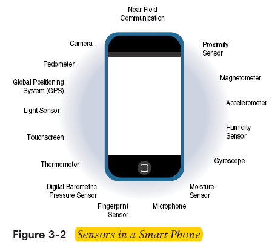
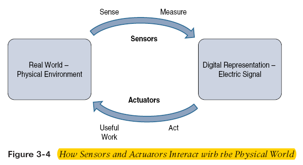
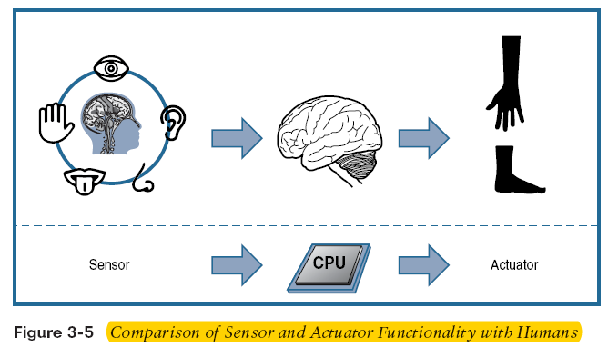
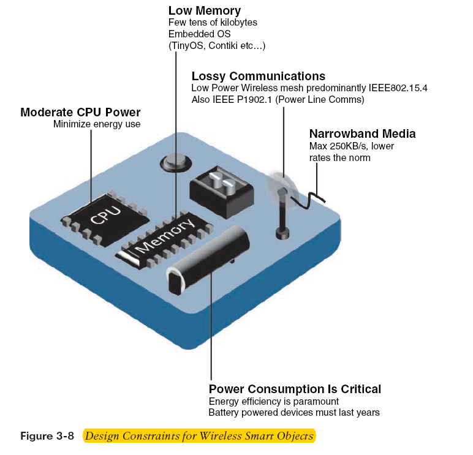
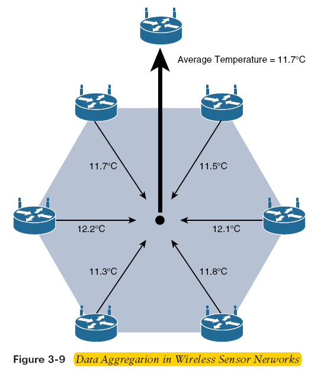

# Smart Objects: The Building Blocks of IoT

Sensors are the fundamental elements of IoT networks. They measure physical quantities and convert these measurements into digital data, which is then processed to yield actionable insights. These sensors are embedded in smart objects—devices that can sense and interact with their environment.

## Overview of Sensors

A sensor's primary function is to "sense" by measuring physical parameters and converting them into a digital format that can be further processed.

### Common Sensor Types

| Sensor Type                 | Description                                                                                                               | Examples                                                 |
| --------------------------- | ------------------------------------------------------------------------------------------------------------------------- | -------------------------------------------------------- |
| **Position**                | Measures an object’s position (absolute or relative); can be linear, angular, or multi-axis.                              | Potentiometer, inclinometer, proximity sensor            |
| **Occupancy & Motion**      | Detects presence and movement. Occupancy sensors trigger even for stationary objects; motion sensors trigger on movement. | Electric eye, radar                                      |
| **Velocity & Acceleration** | Measures speed (linear or angular) or changes in speed.                                                                   | Accelerometer, gyroscope                                 |
| **Force**                   | Detects applied force and its magnitude.                                                                                  | Force gauge, viscometer, tactile sensor                  |
| **Pressure**                | Measures force per unit area (e.g., from liquids or gases).                                                               | Barometer, Bourdon gauge, piezometer                     |
| **Flow**                    | Measures the rate or volume of fluid flow.                                                                                | Anemometer, mass flow sensor, water meter                |
| **Acoustic**                | Measures sound levels and converts them into digital or analog signals.                                                   | Microphone, geophone, hydrophone                         |
| **Humidity**                | Detects the amount of water vapor, measuring absolute or relative humidity.                                               | Hygrometer, humistor, soil moisture sensor               |
| **Light**                   | Detects the presence of visible or invisible light.                                                                       | Infrared sensor, photodetector, flame detector           |
| **Radiation**               | Measures environmental radiation levels.                                                                                  | Geiger-Müller counter, scintillator, neutron detector    |
| **Temperature**             | Measures heat or cold; available in contact (physical touch required) or non-contact (via convection/radiation) forms.    | Thermometer, calorimeter, temperature gauge              |
| **Chemical**                | Detects specific chemicals by measuring their concentration.                                                              | Breathalyzer, olfactometer, smoke detector               |
| **Biosensors**              | Detects biological elements like tissues, cells, enzymes, or nucleic acids.                                               | Blood glucose sensor, pulse oximeter, electrocardiograph |

## Use Case: Precision Agriculture

Precision agriculture uses a range of sensor technologies to improve farming efficiency and productivity. Sensor data (e.g., soil quality, pH, moisture, nutrient levels) are analyzed to:

- Optimize irrigation and fertilization planning
- Predict crop yield and weather impact
- Enhance sustainability and profitability

Innovative examples include biodegradable, passive microsensors developed at North Dakota State University (NDSU) that can be planted in soil and safely biodegrade over time.

## Sensors in Smartphones and Actuators

More than a billion smartphones are sold yearly, each containing numerous sensors that support their functionality.

### Actuators

Actuators complement sensors by converting control signals into physical actions (e.g., motion or force). They are diverse in design and function.

#### Actuator Classification by Energy Type

| Type                              | Examples                                                                                                           |
| --------------------------------- | ------------------------------------------------------------------------------------------------------------------ |
| **Mechanical Actuators**          | Lever, screw jack, hand crank                                                                                      |
| **Electrical Actuators**          | Thyristor, bipolar transistor, diode                                                                               |
| **Electromechanical Actuators**   | AC motor, DC motor, step motor                                                                                     |
| **Electromagnetic Actuators**     | Electromagnet, linear solenoid                                                                                     |
| **Hydraulic/Pneumatic Actuators** | Hydraulic cylinder, pneumatic cylinder, piston, pressure control valves, air motors                                |
| **Smart Material Actuators**      | Shape memory alloy (SMA), ion exchange fluid, magnetorestrictive material, bimetallic strip, piezoelectric bimorph |
| **Micro-/Nanoactuators**          | Electrostatic motor, microvalve, comb drive                                                                        |

## Smart Objects

Smart objects turn everyday items into intelligent devices through:

- **Processing Unit**: Typically a microcontroller for processing sensor data and managing actuators.
- **Sensors/Actuators**: For environment sensing and physical control.
- **Communication Device**: Usually wireless for inter-device connectivity.
- **Power Source**: Often battery-driven, emphasizing low power consumption and efficiency.

The term "smart object" is used interchangeably with smart sensor, IoT device, intelligent node, and related names.

## Sensor and Actuator Networks (SANETs)

SANETs connect numerous sensors and actuators to work collaboratively. For example, smart home systems integrate temperature sensors with HVAC actuators to maintain optimal comfort.

### Wireless Sensor and Actuator Networks (WSANs)

- **Advantages:**
  - Flexible deployments, especially in hard-to-reach areas
  - Scalable to large numbers of nodes
  - Lower implementation and maintenance costs
  - Easy addition of new devices
  - Adaptability to dynamic network topologies
- **Disadvantages:**
  - Potential security vulnerabilities (e.g., hijacked access points)
  - Lower transmission speeds
  - Susceptibility to environmental interference

WSANs, often simply called Wireless Sensor Networks (WSNs), rely on low-cost, constrained nodes that may be deployed in large numbers to improve system accuracy through redundancy.

## Communication Patterns in WSNs

WSNs typically use one of two data transmission patterns:

- **Event-Driven**: Data is sent only when a specific event or threshold is detected.
- **Periodic**: Data is transmitted at regular intervals.
