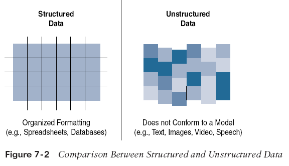
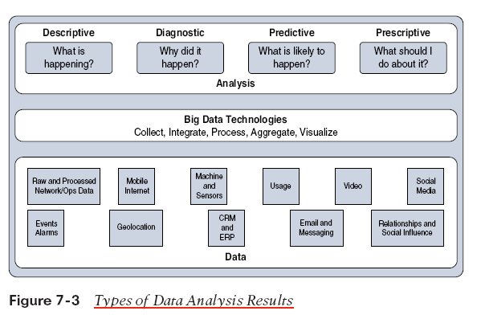

# Data and Analytics for IoT

As more devices join IoT networks, the volume of data generated quickly becomes overwhelming. Traditional data management systems struggle with what has come to be known as “big data.”

## Structured vs. Unstructured Data

- **Structured Data**  
  • Follows a predefined model or schema  
  • Easily managed with relational databases (RDBMS)  
  • Example: IoT sensor data (temperature, pressure, humidity) in a known format

- **Unstructured Data**  
  • Lacks a logical schema for easy parsing  
  • Approximately 80% of a business’s data is unstructured  
  • Requires advanced analytics (cognitive computing, machine learning)

## Data in Motion vs. Data at Rest

- **Data in Motion**  
  • Generated continuously by smart objects  
  • Often processed at the edge (via fog computing)  
  • May be filtered, deleted, or forwarded for further processing

- **Data at Rest**  
  • Stored in IoT brokers or data centers for later analysis

## IoT Data Analytics Challenges

- **Scaling Problems:**  
  • Massive data volumes lead to rapidly growing relational databases  
  • Performance issues may require additional hardware and architectural changes

- **Volatility of Data:**  
  • IoT data models change frequently  
  • A dynamic schema is necessary, unlike the fixed schemas of traditional databases

- **Streaming Data:**  
  • High-volume streams require real-time analysis to extract value

- **Network Analytics:**  
  • Managing, monitoring, and securing continuous data flows from numerous devices is challenging

## Machine Learning and Big Data Intelligence

ML operations for IoT can be grouped into two categories:

- **Local Learning:**  
  • Data is collected and processed locally  
  • Processing happens at the sensor (edge node) or gateway (fog node)

- **Remote Learning:**  
  • Data is sent to a central computing unit (data center or cloud) for processing

### Key ML Applications in IoT

- **Monitoring:**  
  • Smart objects continuously monitor environmental and operational conditions  
  • Data analytics help detect early failure conditions (e.g., identifying deviations using K-means)  
  • Examples: Monitoring air quality in mines, pump pressure in pipelines

- **Behavior Control:**  
  • When monitored parameters cross defined thresholds, alerts are generated or corrective actions are triggered  
  • Examples: Adjusting airflow in a mine tunnel, controlling a robot arm, or reducing engine pressure

- **Operations Optimization:**  
  • Analytics can lead to improved process control and efficiency  
  • Example: In a water purification plant, neural networks process data (chemical type, temperature, stirring speed/depth) to determine the optimal mix for maximum efficiency and reduced chemical consumption

- **Self-Healing and Self-Optimizing Systems:**  
  • Deep learning creates a closed loop of monitoring, decision-making, and action  
  • Systems dynamically adjust parameters and implement optimizations as gains are detected  
  • The system evolves to become self-learning and self-optimizing
