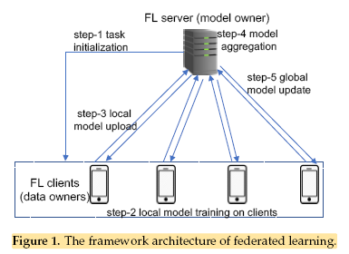
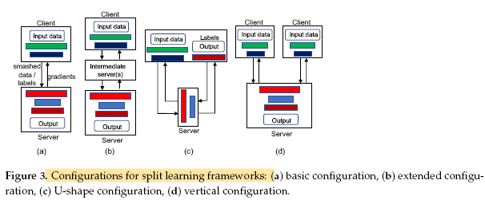
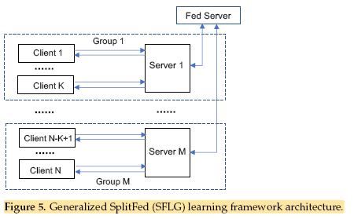
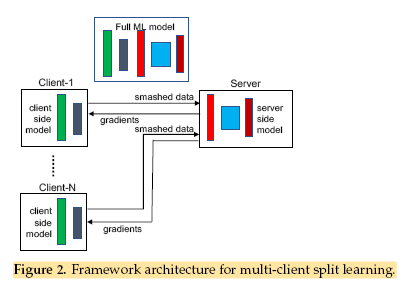

# Combined Federated and Split Learning in Edge Computing for Ubiquitous Intelligence in Internet of Things: State-of-the-Art and Future Directions

## Abstract

Federated Learning (FL) and Split Learning (SL) are two emerging collaborative learning methods that greatly facilitate ubiquitous intelligence in the Internet of Things (IoT). Modern IoT applications leverage machine learning (ML) techniques to provide intelligent services such as smart manufacturing, smart transportation, and smart health. However, the highly dispersed nature of IoT data and distributed ML-based applications pose challenges to traditional cloud-based infrastructures. This document explores the state-of-the-art and future directions of FL and SL in IoT.

---

## Introduction

### Challenges in IoT Intelligence

1. **Data Privacy**: IoT data often contains private information, necessitating local data storage to protect user privacy.
2. **Resource Constraints**: IoT devices often lack sufficient computational resources for training complex ML models.
3. **Scalability**: IoT systems involve large-scale networks with dynamic resource availability.
4. **Communication Overheads**: Wireless networks with constrained bandwidth can become bottlenecks for ML model training.

### Collaborative Learning Approaches

- **Federated Learning (FL)**: Enables multiple data owners to train a global ML model without exposing individual datasets.
- **Split Learning (SL)**: Splits an ML model into client-side and server-side portions, allowing resource-constrained devices to offload part of the training task.

---

## Federated Learning (FL)

### Overview of Federated Learning

FL allows multiple clients to train a global ML model collaboratively. Each client trains a local model using private data and shares the model parameters with a central server for aggregation.

### Challenges in Federated Learning

1. **Statistical Heterogeneity**: Training data is non-iid and varies in volume and statistical features.
2. **System Heterogeneity**: IoT devices have diverse computational and communication capabilities.
3. **Communication Overheads**: Transmitting complex ML models generates significant traffic.
4. **Resource Constraints**: Training full models on resource-limited devices is challenging.
5. **Privacy and Security**: Sharing model updates can reveal sensitive information.

---

## Split Learning (SL)

### Overview of Split Learning

SL splits an ML model into client-side and server-side portions. The client processes local data and sends intermediate results to the server, which completes the forward and backward propagation.

### Advantages

- Reduces computational load on client devices.
- Leverages edge computing for resource management.

### Challenges

1. **Sequential Collaboration**: Limits scalability for large-scale IoT systems.
2. **Communication Overheads**: Frequent interactions between client and server increase traffic.
3. **Performance Metrics**: Requires further study on convergence, accuracy, and training costs.

---

## Combining FL and SL

### Motivation

Combining FL and SL can exploit the advantages of both methods while mitigating their respective drawbacks. This hybrid approach can:

- Utilize diverse and heterogeneous computational resources.
- Leverage big data dispersed across IoT devices.

### Key Insights

- **FL**: Preferred in scenarios where communication is a bottleneck.
- **SL**: Recommended for achieving better model accuracy and faster convergence in high-throughput networks.

---

## Performance Evaluation

### Communication vs. Computation Trade-Off

- FL generates lower communication overheads but requires more computational resources on clients.
- SL reduces client-side computation but increases communication traffic.

### Experimental Results

- FL and SL frameworks deployed on Raspberry Pi devices show that FL performs better in communication-constrained environments, while SL excels in high-throughput networks.

---

## Conclusion

Collaborative learning methods like FL and SL are essential for enabling ubiquitous intelligence in IoT. Combining these methods can fully unleash their potential, addressing challenges in data privacy, resource constraints, and scalability.

---

